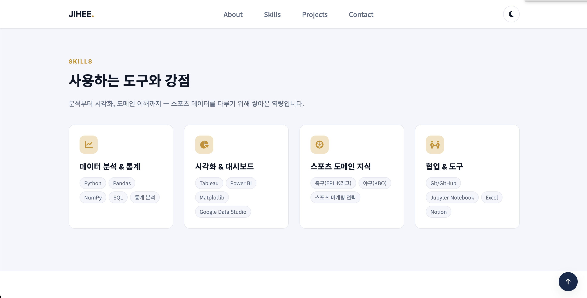
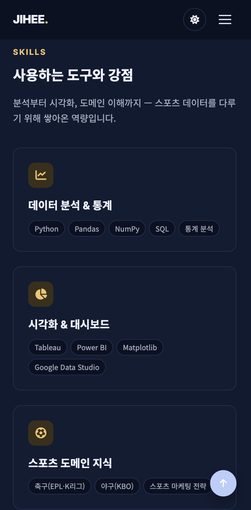
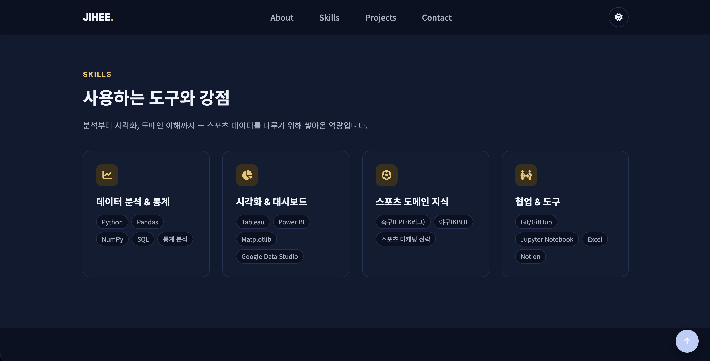

# 박지희 | Sports Data Analyst Portfolio

스포츠 마케팅과 경기 데이터, 두 분야를 중심으로 분석 프로젝트를 진행하는 데이터 분석가 박지희의 포트폴리오 웹사이트입니다. 외부 프레임워크 없이 순수 HTML/CSS/JavaScript로 제작했습니다.

## 배포 URL

- https://jiheepark1009.github.io/B1-mypage/

## 사용 기술

- **HTML5** — 시맨틱 마크업 (`header`, `nav`, `main`, `section`, `article`, `footer`)
- **CSS3** — Vanilla CSS, CSS 변수(`:root`), Flexbox, Grid, 반응형(모바일 퍼스트)
- **JavaScript (ES6+)** — Vanilla JS, `fetch`/`async-await`, `IntersectionObserver`, 화살표 함수, 구조분해 할당, `map`/`filter`/`forEach`
- **GitHub REST API** — `/users/{username}/repos`
- **Font Awesome**, **Google Fonts**(Inter, Noto Sans KR) — 아이콘 및 웹 폰트만 외부 리소스로 사용

## 주요 기능

- 반응형 레이아웃 (모바일 퍼스트, 768px / 1024px 브레이크포인트)
- 다크 모드 토글 — `localStorage`에 저장되어 새로고침 후에도 유지
- 햄버거 메뉴 토글, 앵커 링크 부드러운 스크롤
- 스크롤 위치에 따른 네비게이션 배경 전환 / 맨 위로 버튼 노출
- `IntersectionObserver` 기반 스크롤 등장 애니메이션, 히어로 통계 숫자 카운트업
- GitHub API 연동 프로젝트 카드 — 로딩(스켈레톤) / 성공 / 에러(재시도 버튼) / 빈 상태 처리
- 대표 프로젝트 카테고리 필터 (전체 / 스포츠 마케팅 / 경기 데이터)
- Contact 문의 폼 유효성 검사 (필수값, 이메일 형식) 및 제출 성공 메시지

## 기준값

과제 요구사항에 따라 자유롭게 설정 가능한 인터랙션 기준값을 아래와 같이 지정했습니다. (`js/main.js` 상단 상수로 관리)

| 인터랙션 | 기준값 |
| --- | --- |
| 네비게이션 배경 전환 | 스크롤 `60px` 이상 |
| 맨 위로 버튼 노출 | 스크롤 `300px` 이상 |
| 스크롤 등장 애니메이션 (`IntersectionObserver`) | `threshold: 0.2` |

## 폴더 구조

```
B1-mypage/
├── index.html
├── css/
│   └── style.css
├── js/
│   └── main.js
├── images/
│   ├── hero-graphic.svg
│   ├── profile.svg
│   ├── thumb-marketing.svg
│   └── thumb-data.svg
└── README.md
```

## 로컬 실행 방법

1. VS Code에서 프로젝트 폴더(`B1-mypage`)를 엽니다.
2. `Live Server` 확장 프로그램을 설치합니다.
3. `index.html`을 우클릭 → **Open with Live Server** 를 선택합니다.

## 스크린샷

> `images/screenshots/` 폴더에 아래 파일명으로 캡처 이미지를 추가하면 표가 자동으로 채워집니다. (macOS 단축키: `Cmd + Shift + 4`)

| 데스크톱 | 모바일 | 다크 모드 |
| --- | --- | --- |
|  |  |  |

## 참고사항

- GitHub API는 인증 없이 호출하므로 시간당 60회 요청 제한이 있습니다. 제한 초과(403) 시 에러 상태 UI(재시도 버튼 포함)가 표시됩니다.
- Projects 섹션의 "대표 프로젝트" 카드는 예시 콘텐츠이며, 추후 실제 프로젝트 내용으로 교체될 예정입니다.
